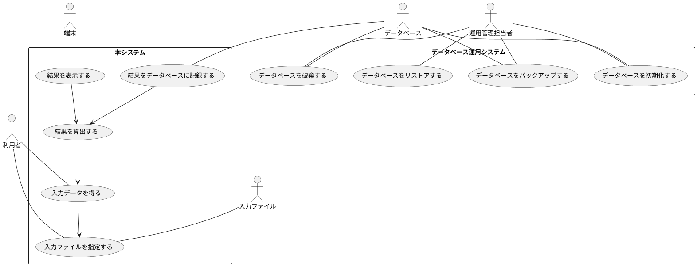
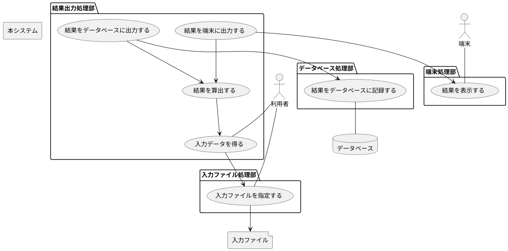
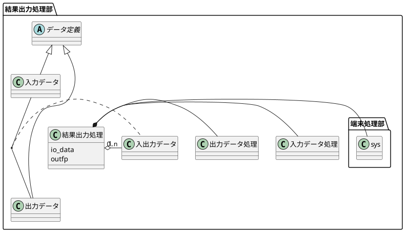
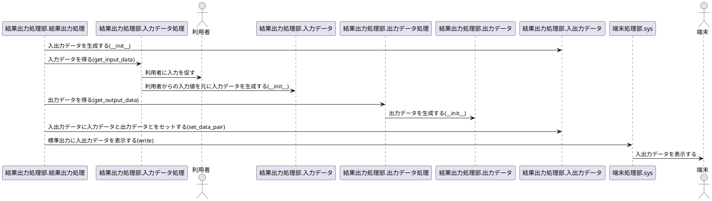
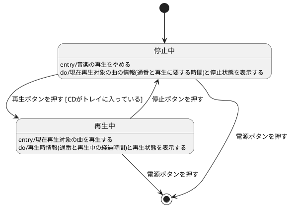

# PlantUMLの利用

本開発では, 原則としてUnified Modeling Language (UML)表記で設計を図示する。
UMLの表記法については, [UML モデリングのエッセンス](https://www.amazon.co.jp/dp/4798107956)などを参照。

本文書では, 本開発で使用する範囲のPlantUMLの表記についてのみ述べる。他の表記については, [PlantUML公式文書](https://plantuml.com/ja/)を参照。

## 目次

- [PlantUMLの利用](#plantumlの利用)
  - [目次](#目次)
  - [本開発で使用するUML図](#本開発で使用するuml図)
  - [PlantUMLでのUML図表記法](#plantumlでのuml図表記法)
    - [markdownファイル中でのUML図の記載法](#markdownファイル中でのuml図の記載法)
    - [PlantUMLでのコメント表記方法](#plantumlでのコメント表記方法)
    - [ユースケース図](#ユースケース図)
      - [ユースケース図とは](#ユースケース図とは)
      - [ユースケース図の要素](#ユースケース図の要素)
      - [ユースケース図の表記法](#ユースケース図の表記法)
    - [パッケージ図](#パッケージ図)
      - [パッケージ図とは](#パッケージ図とは)
      - [パッケージ図の要素](#パッケージ図の要素)
      - [パッケージ図の表記法](#パッケージ図の表記法)
    - [クラス図](#クラス図)
      - [クラス図とは](#クラス図とは)
      - [クラス図に記載する内容](#クラス図に記載する内容)
        - [集約やコンポジションに関わるフィールドを明記する理由](#集約やコンポジションに関わるフィールドを明記する理由)
      - [クラス図に記載しない内容](#クラス図に記載しない内容)
      - [クラス図の要素](#クラス図の要素)
        - [関連の多重度の表記方法](#関連の多重度の表記方法)
      - [クラス図の表記法](#クラス図の表記法)
    - [シーケンス図](#シーケンス図)
      - [シーケンス図とは](#シーケンス図とは)
      - [シーケンス図の要素](#シーケンス図の要素)
        - [__を含む場合のメソッド名の記載法](#__を含む場合のメソッド名の記載法)
      - [シーケンス図の表記法](#シーケンス図の表記法)
        - [アクターや参加者の一覧を記載する際の順序](#アクターや参加者の一覧を記載する際の順序)
    - [状態マシン図](#状態マシン図)
      - [状態マシン図とは](#状態マシン図とは)
      - [状態マシン図の要素](#状態マシン図の要素)
      - [状態マシン図の表記法](#状態マシン図の表記法)

## 本開発で使用するUML図

本開発では, 以下のUML図を使用して設計を図示する。

|UML図|用途|
|-----|----|
|ユースケース図|開発対象のシステム(以下`開発システム`と記載)の振る舞いと開発対象のシステム以外のシステムとの関係とシステム全体で実施する振る舞いの内開発対象のシステムが実施しない振る舞いを記載することで開発システムの責務の範囲を記載する|
|パッケージ図|開発システム内のロードモジュール構成およびロードモジュールの論理構成を記載する|
|クラス図|開発システムを構成するプログラムモジュール(クラスなど)構成を記載する|
|シーケンス図|ユースケース図で記載した開発システムの振る舞いを実現する際に開発システム内外のモジュールや外部システムが実施する処理の流れを記載する|
|状態マシン図|外部からのイベントに応じた開発システムの内部状態の遷移と状態遷移時に実施する処理を記載する|


## PlantUMLでのUML図表記法

本節では, PlantUMLでのUML図表記法について述べる。

### markdownファイル中でのUML図の記載法

本開発では, 付帯文書を[markdown記法](https://daringfireball.net/projects/markdown/)で記載する。

本開発では, markdown中に以下の形式でPlantUML表記によりUML図を記載する。

````markdown
```plantuml
@startuml
PlantUMLによるUML図表記
@enduml
```
````

### PlantUMLでのコメント表記方法

PlantUMLでは, 複数行にわたるコメントを`/'`と`'/`で囲って記載する。一行コメントは, `'`で記載する。コメントの記載例は以下の通り。

```text
/' コメントの例
   複数行コメント
'/

'一行コメント
```

### ユースケース図

本節では, ユースケース図の表記方法について述べる。

#### ユースケース図とは

ユースケース図は, 外部のシステムから見て, 開発対象システムがどのように振る舞うかを記載した図である。

開発システムがユーザや他のシステムに提供する機能・振る舞いおよび**開発対象システムで扱わない機能・振る舞い**を図示するために使用する。

#### ユースケース図の要素

ユースケース図の要素は以下の通り

|要素|PlantUMLでの表記|意味|
|----|----------------|----|
|アクター|actor アクター名|開発システムのユーザを表す。アクターには, システムの利用者, 開発対象システムと連携して動作する他のソフトウエアシステム, ハードウエアを記載する。|
|ユースケース|usecase ユースケース|開発システムのユーザ間で共通の目的を実現するシナリオを記載する。|
|関連(Association)|アクター `--` ユースケース:意味|どのアクターがどのユースケースを実施するかを表す線分|
|依存関係|ユースケース1 `-->` ユースケース2|ユースケース1がユースケース2に依存することを表す矢印|

典型的には, 上記のアクターには, 以下を記載する。

- 開発システムの利用者
- 開発システムが提供する機能を呼び出すソフトウエア
- 開発システムから呼び出す(ライブラリやOSなどの)他のソフトウエア
- 割込みやシグナル, 例外などを開発システムに通知するCPU/デバイスなどのハードウエア
- 出力結果を画面に表示する端末

#### ユースケース図の表記法

本開発では, ユースケース図を以下の形式のPlantUML表記で記載する。

```text
アクターの一覧
rectangle "開発システム" {
開発システムのユースケースの一覧
}
rectangle "開発システム外のシステム" {
開発システム外のシステムのユースケースの一覧
}
...
ユースケースを実現するアクター
ユースケース間の依存関係
```

ユースケースの記載例として, 利用者が端末または入力ファイルから入力データを元に結果を算出し, 端末に結果を表示, または, 運用管理担当者が用意したデータベースに結果を記録するシステムに対するユースケース図を以下に示す。

```text
@startuml
/' アクターの一覧
'/
actor 利用者
actor 運用管理担当者
actor 端末
actor データベース
actor 入力ファイル
/' 開発システム内のユースケースの一覧
'/
rectangle "本システム" {
  usecase 入力ファイルを指定する
  usecase 入力データを得る
  usecase 結果を算出する
  usecase 結果を表示する
  usecase 結果をデータベースに記録する
}
/' 開発システム外のユースケースの一覧
'/
rectangle "データベース運用システム" {
  usecase データベースを初期化する
  usecase データベースをバックアップする
  usecase データベースをリストアする
  usecase データベースを破棄する
}
/' ユースケースを実現するアクター
'/
利用者 -- 入力ファイルを指定する
利用者 -- 入力データを得る
端末 -- 結果を表示する
データベース -- 結果をデータベースに記録する
入力ファイル -- 入力ファイルを指定する
運用管理担当者 -- データベースを初期化する
運用管理担当者 -- データベースをバックアップする
運用管理担当者 -- データベースをリストアする
運用管理担当者 -- データベースを破棄する
データベース -- データベースを初期化する
データベース -- データベースをバックアップする
データベース -- データベースをリストアする
データベース -- データベースを破棄する
/' ユースケース間の依存関係
'/
結果を算出する --> 入力データを得る
入力データを得る --> 入力ファイルを指定する
結果を表示する --> 結果を算出する
結果をデータベースに記録する --> 結果を算出する
```

上記を図示した例を以下に示す。



### パッケージ図

本節では, パッケージ図の表記方法について述べる。

#### パッケージ図とは

パッケージ図は, UMLの要素をグループ化することで, 論理的な枠組みを与え, 開発対象システムの論理構造を図示する。

#### パッケージ図の要素

パッケージ図の要素は以下の通り。PlantUMLでは, パッケージ図は, 配置図(Deployment Diagram)の一種として扱われる。また, PlantUMLでは, 原則として, パッケージに含まれるクラスの定義はクラス図で表記する。

|要素|PlantUMLでの表記|意味|
|----|----------------|----|
|アクター|actor アクター名|開発システムのユーザを表す。|
|ユースケース|usecase ユースケース|開発システムのユーザ間で共通の目的を実現するシナリオを記載する。|
|ファイル|file ファイル名|開発システム中で利用するファイルを表す。
|データベース|database データベース名|開発システム中で利用するデータベースを表す。|
|パッケージ|package パッケージ名|UMLの要素のグループを表す。典型的には, プログラムのロードモジュールをパッケージの一つとして表記する。|
|関連(Association)|要素1 `--` 要素2:意味|`要素1`と`要素2`が`意味`に記した関連を持つことを表す。|
|依存関係|要素1 `-->` 要素2|`要素1`が`要素2`に依存することを表す矢印|

#### パッケージ図の表記法

本開発では, パッケージ図を以下の形式のPlantUML表記で記載する。

```text
開発システムを構成するUMLの要素の一覧
rectangle 開発システムの名称 {
  package パッケージ名 {
    パッケージ内のユースケースの一覧
  }
  ...
}
要素間の依存関係
```

例として, 利用者が端末または入力ファイルから入力データを元に結果を算出し, 端末に結果を表示, まやは, データベースに結果を記録するシステムに対するパッケージ図の記載例を以下に示す。

```text
/' 開発システムを構成するUMLの要素の一覧
'/
actor 利用者
actor 端末
database データベース
file 入力ファイル
package 結果算出処理部
package 端末処理部
package データベース処理部
package 入力ファイル処理部

/' パッケージの定義
'/
rectangle 本システム {
  package 結果算出処理部 {
    usecase 入力データを得る
    usecase 結果を算出する
  }
  package 端末処理部 {
    usecase 結果を表示する
  }
  package データベース処理部 {
    usecase 結果をデータベースに記録する
  }
  package 入力ファイル処理部 {
    usecase 入力ファイルを指定する
  }
}
/' 要素間の依存関係
'/
利用者 -- 入力ファイルを指定する
利用者 -- 入力データを得る
端末 -- 結果を表示する
結果を算出する --> 入力データを得る
入力データを得る --> 入力ファイルを指定する
入力ファイルを指定する --> 入力ファイル
結果を表示する --> 結果を算出する
結果をデータベースに記録する --> 結果を算出する
結果をデータベースに記録する -- データベース
```

上記を図示すると以下のようになる。



### クラス図

本節では, クラス図の表記方法について述べる。

#### クラス図とは

クラス図は, プログラムのロードモジュール内の構成を表す。

オブジェクト指向言語を使用する場合は, クラス図をロードモジュールを構成するオブジェクトを定義するクラス群とクラス間の関係を図示するために用いる。

C言語などの非オブジェクト指向言語を使用する場合は, クラス図をオブジェクトファイル単位で作成し, 各オブジェクトファイル内の大域変数をクラスのメンバ変数, オブジェクトファイル内の外部リンケージ関数をインターフェースメソッドと見なして記載する。

#### クラス図に記載する内容

本開発では, 以下をクラス図中に記載する

1. 他のクラスとの拡張関係(継承関係)図
2. 他のクラスの機能を使用するクラスの場合は, 他のクラスとの機能の依存関係をコンポジションによって表記する
3. 他のクラスのインスタンスのコレクションとしての役割を果たすクラスの場合は, コレクションの対象となるインスタンスのクラスを集約によって表現する
4. 他のオブジェクトを関連付けるオブジェクトを導入する場合は, 各オブジェクトを定義するクラス間の関連付けを関連として表記する
5. 他のクラスと集約やコンポジション関係を持つクラスの場合は, 集約やコンポジションに関わるメンバ変数をクラスのフィールドとして表記する。
6. 他のクラスを集約するクラスについては, 集約の多重度を明記する

##### 集約やコンポジションに関わるフィールドを明記する理由

UMLの表記法の観点からは, 集約やコンポジションに関わるフィールドは関連のロール名を関連付けられるクラス側に記載する方が, より関連に関係する要素を強調して表現可能であることから望ましい。

しかしながら, PlantUMLでは, 関連のロール名を関連付けられるクラス側に記載することが難しいことから集約やコンポジションに関わるフィールドを関連付けるクラス側のフィールドとして記載する方針とした。

#### クラス図に記載しない内容

本開発では, 以下をクラス図中には記載しない。

1. プライベートメンバ変数
2. プライベートメンバメソッド
3. 他のクラスとのコンポジションや集約関係に関係しないプロテクテッドメンバ変数
4. プロテクテッドメンバメソッド

#### クラス図の要素

クラス図の要素は以下の通り。

|要素|PlantUMLでの表記|意味|
|----|----------------|----|
|クラス|class クラス名|ロードモジュールによって生成されるロードイメージを構成する各オブジェクトを定義するクラスを表す。|
|抽象クラス|abstract class クラス名|他のクラスの親クラスとなる抽象クラス(インスタンスを生成することが不可能なクラス)を表す。|
|インターフェース|interface インターフェース名|クラスが実装しなければならないメソッド群を定義するクラスを表す。インターフェースは, メソッドのみを持ち, フィールドを持たない。|
|パッケージ|package パッケージ名|UMLの要素のグループを表す。|
|継承(拡張, Extention)|親クラス `<|--` 子クラス|`親クラス`を継承して`子クラス`を定義する。親クラスを左に, 子クラスを右に記載する。|
|コンポジション(Composition)|全体側クラス `*--` 部分側クラス|全体と部分の関係を表す。全体側のクラスを左に, 部分側のクラスを右に記載する。本開発では, 全体側のクラスの機能を, 部分側のクラスの機能を利用して実現することを示すために用いる。|
|集約(Composition)|コレクションを格納するクラス `"多重度" o-- "多重度"` コレクションの要素を定義するクラス|独立して存在できる何かのコレクションを格納するクラスとその要素となるクラスを表現する。コレクションを格納する側のクラスを左に, 格納されるコレクションの要素を表すクラスを右に記載する。|
|関連(Association)|クラス名1 `--` クラス名2|`クラス1`と`クラス2`が互いに関連づけられることを表す。本開発では, 継承(拡張), コンポジション, 集約以外のクラス間の関連を`関連`を用いてクラス間を実線(`--`)で結ぶことで表現する。|
|関連を定義するクラス|(関連付けられるクラス1, 関連付けられるクラス2) .. 2つのクラスの関連を定義するクラス|2つのクラスを関連付けるクラスを表記する。本開発では, 関連と2つのクラスを関連付けるクラスを破線(`..`)で結んで表現する。PlantUMLの表記ルール上, 2つのクラスの関連を記載した後で, その関連を定義するクラスを記載する。|

クラス図では, パッケージを用いて以下を表記する。

|表記する対象|説明|
|------------|----|
|プログラムのロードモジュール|プログラムを構成する各ロードモジュールを, パッケージの一つとして表記する。|
|クラス間の論理構成|クラス群に対する論理構成を表記するためにパッケージを用いる。ロードモジュール中のオブジェクト群の論理構成をそれらのオブジェクトを定義するクラス群を包含したパッケージとして表記する。|

##### 関連の多重度の表記方法

集約の場合は, コレクション可能な要素の数を多重度によって明記する。本開発では, markdownの表記との衝突を避けるため, 0個以上を表す多重度を`"0..n"`と表記し, `"*"`は使用しない。本開発では, 多重度を省略した場合は, 1対1に関連づけられることを示す。集約以外の関連について, 2つ以上の要素が関連づけられる場合は, 多重度を明記する。

#### クラス図の表記法

本開発では, クラス図を以下の形式のPlantUML表記で記載する。

```text
package パッケージ名 {
  パッケージに含まれるクラス{
    コンポジションや集約に関係するフィールド(メンバ変数)
  パッケージ内の継承の一覧
  パッケージ内のコンポジションの一覧
  パッケージ内の集約の一覧
  パッケージ内の関連の一覧
  パッケージ内の関連を定義するクラスの一覧
  }
  ...
}
...
```

クラス図の表記例を以下に示す。

```text
/' 結果出力処理部のクラスの一覧
'/
package 結果出力処理部 {
  class 結果出力処理{
    {field} io_data
    {field} outfp
  }
  class 入力データ処理
  class 出力データ処理
  abstract class データ定義
  class 入力データ
  class 出力データ
  class 入出力データ

/' パッケージ内の継承の一覧
'/
データ定義 <|-- 入力データ
データ定義 <|-- 出力データ
/' パッケージ内のコンポジションの一覧
'/
結果出力処理 *- 入力データ処理
結果出力処理 *- 出力データ処理
結果出力処理 *- 端末処理部.sys
/' パッケージ内の集約の一覧
'/
結果出力処理 "1" o- "0..n" 入出力データ
/' パッケージ内の関連の一覧
'/
入力データ -- 出力データ
/' パッケージ内の関連を定義するクラスの一覧
'/
(入力データ, 出力データ) .. 入出力データ
}
```

上記を図示すると以下のようになる。
他のパッケージ内のクラスを表す場合は, `パッケージ名.クラス名`と記載する。



### シーケンス図

本節では, シーケンス図の表記方法について述べる。

#### シーケンス図とは

シーケンス図は, 開発システムの振る舞いを実現するためのオブジェクト間で実施する処理の流れ(シーケンス)を図示する。

本開発では, シーケンス図を, ユースケース図に記載されたユースケースを実現するオブジェクト間での処理の流れを記載するために使用する。

#### シーケンス図の要素

シーケンス図の要素は以下の通り

|要素|PlantUMLでの表記|意味|
|----|----------------|----|
|参加者(Participant)|participant クラス名|処理を行うオブジェクトを定義するクラスを表す。|
|アクター(Actor)|actor アクター名|開発システムのユーザを表す。アクターには, システムの利用者, 開発対象システムと連携して動作する他のソフトウエアシステム, ハードウエアを記載する。|
|メッセージ(Message)| 参加者(またはアクター)1 `->` 参加者(またはアクター)2 : `処理内容` | 参加者(またはアクター)1 から 参加者(またはアクター)2に`処理内容`に記載された処理を呼び出す。`処理内容`には, 参加者(またはアクター)2が実施する処理の内容を記載する。参加者(またはアクター)2がオブジェクトの場合は, 必要に応じて, `処理内容(メソッド名)`の形式でメソッド名を記載することで, 呼び出されるメソッドを表記する。|

##### __を含む場合のメソッド名の記載法

PlantUMLでは, `__`は, 下線表示指示として扱われる。処理内容のメソッド名が`__`から開始される場合は, `~`をつけることで`__`を記載することができる。

記載例を以下に示す。

```text
メイン処理 -> データ処理:データ処理オブジェクトを生成する(~__init__)
```

#### シーケンス図の表記法

本開発では, 所定のユースケースを実現するシーケンス図を以下の形式のPlantUML表記で記載する。

```text
アクターや参加者の一覧
ユースケースを実現するシーケンス
```

シーケンス図の表記例を以下に示す。パッケージ名を含めて参加者となるオブジェクトを定義するクラスを記載する場合は, `パッケージ名.クラス名`と記載する。

```text
/' アクターや参加者の一覧
'/
participant 結果出力処理部.結果出力処理
participant 結果出力処理部.入力データ処理
actor 利用者
participant 結果出力処理部.入力データ
participant 結果出力処理部.出力データ処理
participant 結果出力処理部.出力データ
participant 結果出力処理部.入出力データ
participant 端末処理部.sys
actor 端末
/' ユースケース"結果を表示する"を実現するシーケンス
'/
結果出力処理部.結果出力処理 -> 結果出力処理部.入出力データ:入出力データを生成する(~__init__)
結果出力処理部.結果出力処理 -> 結果出力処理部.入力データ処理:入力データを得る(get_input_data)
結果出力処理部.入力データ処理 -> 利用者: 利用者に入力を促す
結果出力処理部.入力データ処理 -> 結果出力処理部.入力データ:利用者からの入力値を元に入力データを生成する(~__init__)
結果出力処理部.結果出力処理 -> 結果出力処理部.出力データ処理: 出力データを得る(get_output_data)
結果出力処理部.出力データ処理 -> 結果出力処理部.出力データ: 出力データを生成する(~__init__)
結果出力処理部.結果出力処理 -> 結果出力処理部.入出力データ:入出力データに入力データと出力データとをセットする(set_data_pair)
結果出力処理部.結果出力処理 -> 端末処理部.sys: 標準出力に入出力データを表示する(write)
端末処理部.sys -> 端末: 入出力データを表示する
```

上記を図示すると以下のようになる。



##### アクターや参加者の一覧を記載する際の順序

PlantUMLでは, アクターや参加者は記載順に左から右に配置される。

再帰呼び出し箇所をシーケンス図から判断できるようにするために, 以下の規則でアクターや参加者の一覧を記載する。本規則に従って記載されたシーケンス図では, 右側の参加者からより左側にある参加者を呼び出す箇所は, 再帰呼び出しを意味する。

1. 原則として, 自作のオブジェクトを表す参加者, サードパーティのライブラリによって生成されるオブジェクトを表す参加者, (言語システムおよび標準パッケージ・ライブラリなどの）システムによって生成されるオブジェクトを表す参加者の順に記載する。

2. 再帰呼び出しの場合を除き, 呼び出す側のアクターや参加者を呼び出される側のアクターや参加者より先に記載する。

3. 1.の原則に従った場合に, 呼び出される側のアクターや参加者がそのアクターや参加者を呼び出す全ての参加者の右側に配置できない場合は, 2.の規則(呼び出す側のアクターや参加者を呼び出される側のアクターや参加者より先に記載することを優先する)を優先する。

### 状態マシン図

本節では, 状態マシン図の表記方法について述べる。

#### 状態マシン図とは

オブジェクトの外部から与えられたイベントに応じて変化するオブジェクト内部の状態の遷移とイベントの受信や状態遷移を契機として実行するオブジェクトの振る舞いを図示するために状態マシン図を用いる。

#### 状態マシン図の要素

PlantUMLでは, 状態マシン図をステート図を用いて記載する。状態マシン図の要素は以下の通り。

|要素|PlantUMLでの表記|意味|
|----|----------------|----|
|始点|[*]|初期状態を表す|
|終点|[*]|最終状態を表す|
|状態|state `状態名`: `状態下での処理` |遷移によって遷移する状態を表す。|
|遷移|`状態1` -> `状態2` : `トリガーシグネチャ [ガード]/アクティビティ`|`状態1`から`状態2`に遷移する契機となるイベントを表す。`トリガーシグネチャ`に, イベントの名称を記載する。状態遷移を引き起こすための条件がある場合は, 状態遷移を引き起こすために成立する必要がある(条件の評価値が真である)前提条件を`[ガード]`に記載する。`状態1`からの状態遷移に伴って実施する処理がある場合は, その処理を`/アクティビティ`に記載する。|

上記の`状態下での処理`には, 遷移先の状態下で継続的に実施する処理や遷移先の状態に遷移した時点で実施する処理を記載する。これらの処理がない場合は, 状態を`state 状態名`と記載し, 状態下での処理を記載する必要は無い。

|状態の説明|意味|
|----------|----|
|do/アクティビティ|対象の状態にある間は継続的に実施する処理があれば, `アクティビティ`に処理内容を記載する|
|entry/アクティビティ|対象の状態に遷移した際に実施する処理があれば, `アクティビティ`に処理内容を記載する|

#### 状態マシン図の表記法

本開発では, 状態マシン図を以下の形式のPlantUML表記で記載する。

```text
状態の一覧
遷移の一覧
```

[ステートマシン図& 状態遷移表チュートリアル](http://www.changevision.co/tutorial-statemachine-japanese.html)に記載された以下の状態遷移を例に状態遷移図の記載例を示す。

1. CDプレーヤーは, 動作開始当初はCDを再生せずに停止している
2. CDプレーヤーが停止しているときは, 現在再生対象の曲の情報(通番と再生に要する時間)と停止状態を表示する
3. CDプレーヤーが停止しているときに、利用者が再生ボタンを押すと, CDがトレイに入っている場合は, CDプレーヤーは現在再生対象の曲を再生し, その曲の再生時情報(通番と再生中の経過時間)と再生状態を表示する
4. CDプレーヤーが曲を再生しているときに, 利用者が停止ボタンを押すと, CDプレーヤーは音楽の再生をやめて停止する
5. 再生中または停止中に電源ボタンを押した場合, CDプレイヤーは動作を終了する

上記の例の状態遷移を表す状態マシン図の表記例を以下に示す。

```text
/' 状態の一覧
'/
state 停止中:entry/音楽の再生をやめる
state 停止中:do/現在再生対象の曲の情報(通番と再生に要する時間)と停止状態を表示する
state 再生中:entry/現在再生対象の曲を再生する
state 再生中:do/再生時情報(通番と再生中の経過時間)と再生状態を表示する
/' 遷移の一覧
'/
[*] -->  停止中
停止中 --> 再生中:再生ボタンを押す [CDがトレイに入っている]
再生中 --> 停止中: 停止ボタンを押す
停止中 --> [*]: 電源ボタンを押す
再生中 --> [*]: 電源ボタンを押す
```

上記を図示すると以下のようになる。

